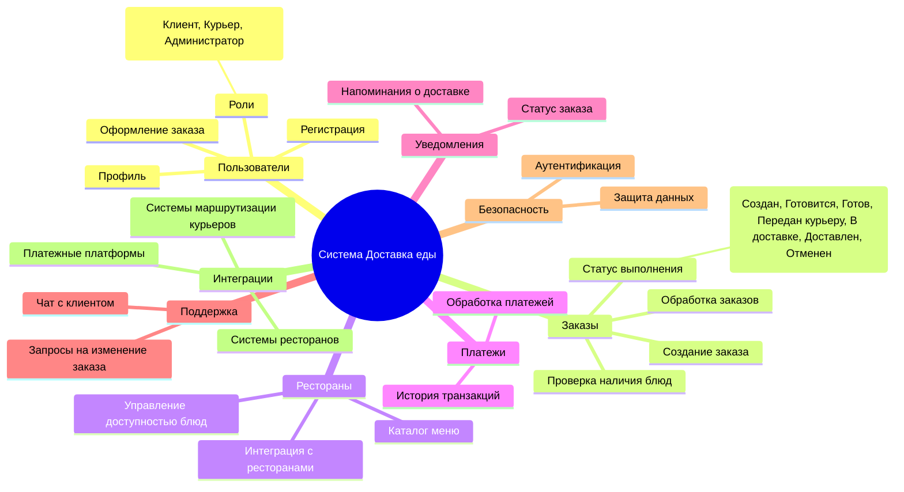
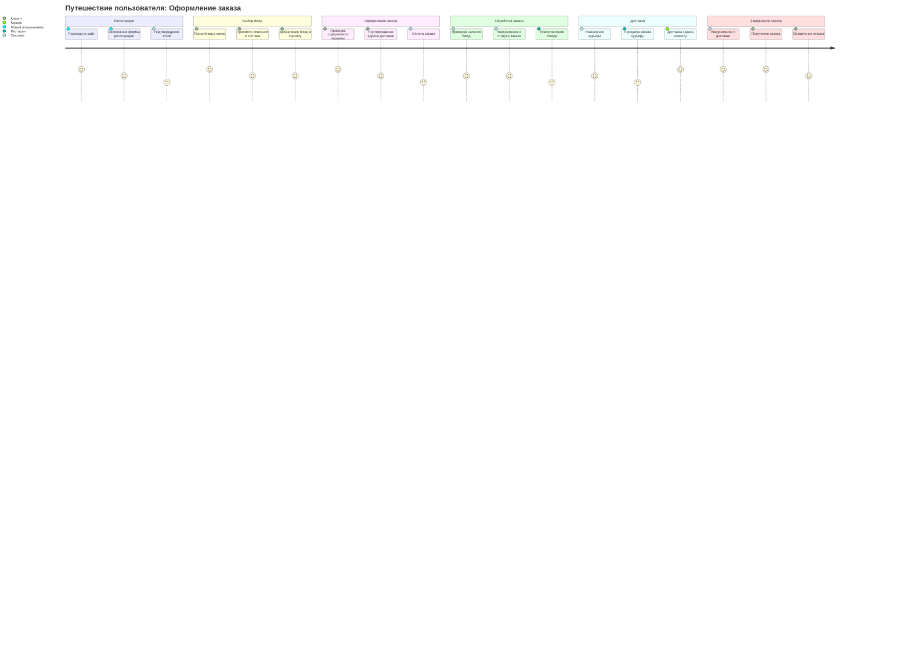
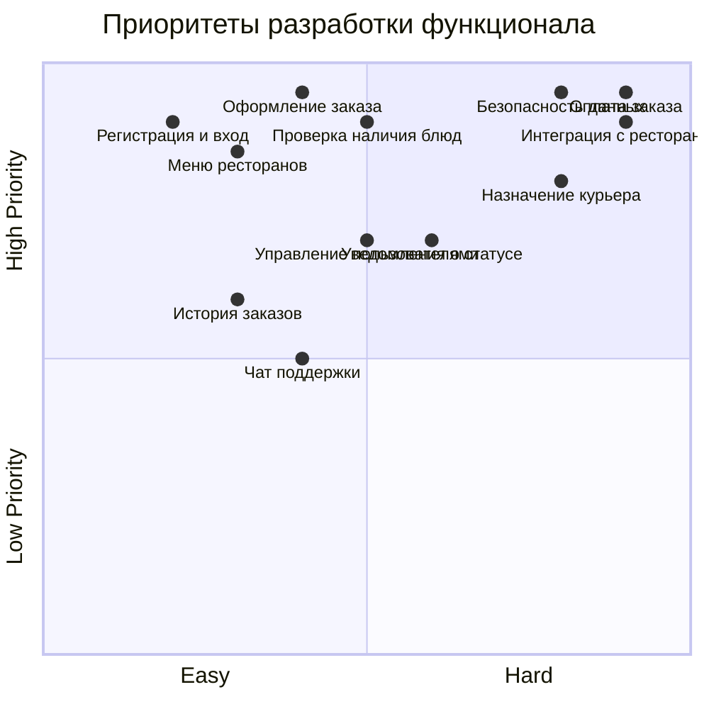
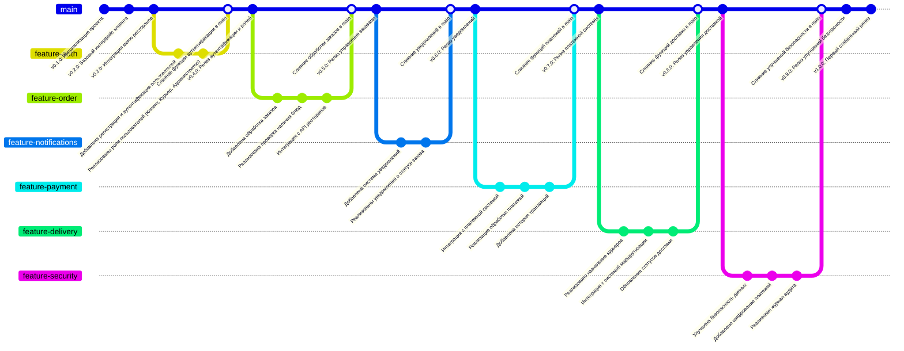

# Sem7_PKSS_PR12
Освоение синтаксиса и возможностей Mermaid для создания различных типов диаграмм в документах Markdown
# Система "Доставка еды"

Проект "Доставка еды" разработан для управления процессом оформления заказов, взаимодействия с ресторанами, курьерами и платежными системами. Ниже представлены визуализации, описывающие архитектуру и процесс разработки системы.

---

## 1. Mind Map: Основные модули системы

**Описание:**  
Диаграмма Mind Map отображает основные модули системы, включая управление пользователями, заказами, интеграции с ресторанами и курьерами, а также платежи и безопасность.

---

## 2. User Journey Diagram: Путь пользователя

**Описание:**  
Диаграмма User Journey описывает путь пользователя через систему, начиная от регистрации и выбора блюд до получения заказа и оставления отзыва.

---

## 3. Quadrant Chart: Приоритеты функционала

**Описание:**  
Диаграмма Quadrant Chart анализирует сложность и приоритет реализации функций системы, помогая расставить акценты на ключевых задачах.

---

## 4. Gitgraph: Процесс разработки

**Описание:**  
Диаграмма Gitgraph отображает процесс разработки системы через ветки репозитория, начиная с инициализации проекта до первого стабильного релиза (`v1.0.0`). Каждая ветка представляет разработку отдельного функционала: аутентификация, заказы, уведомления, платежи, доставка и безопасность.

---

Эти визуализации помогут разработчикам и участникам проекта понять структуру системы, этапы её разработки и приоритеты для реализации ключевых функций.
